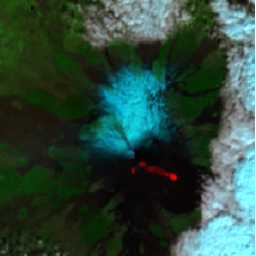

# Raster Extension Specification

- **Title:** Raster
- **Identifier:** `https://stac-extensions.github.io/raster/v1.0.0/schema.json`
- **Field Name Prefix:** raster
- **Scope:** Item, Collection
- **Extension [Maturity Classification](https://github.com/radiantearth/stac-spec/tree/master/extensions/README.md#extension-maturity):** Proposal
- **Owner**: @emmanuelmathot

This document explains the Raster Extension to the [SpatioTemporal Asset Catalog](https://github.com/radiantearth/stac-spec) (STAC) specification.

An item can describe assets that are rasters of one or multiple bands with some information common to them all (raster size, projection)
and also specific to each of them (data type, unit, number of bits used, nodata).
A raster is ofthen strongly linked with the the georeferencing transform and coordinate system definition
of all bands (using the [projection extension](https://github.com/radiantearth/stac-spec/tree/master/extensions/projection)).
In many applications, it is interesting to have some metadata about the raster in the asset (values statistics, value interpretation, transforms).
Finally, it is helping the user to have some rendering hints of the item using one or
more raster assets (RGB combination, simple band value processing) and to create on the fly visualisation with dynamic tilers.

- Examples:
  - [Planet Item example](examples/item-planet.json): Shows the basic usage of the extension in a STAC Item
  - [Sentinel-2 Item example](examples/item-sentinel2.json): Shows the statistics about individual bands and some RGB composites example
  - [Landsat-8 Item example](examples/item-landsat8.json): Shows the advanced composite example with band math processing
- [JSON Schema](json-schema/schema.json)
- [Changelog](./CHANGELOG.md)

## Item Asset fields

| Field Name   | Type                                         | Description                                                                                                                     |
| ------------ | -------------------------------------------- | ------------------------------------------------------------------------------------------------------------------------------- |
| raster:bands | \[[Raster band Object](#raster-band-object)] | An array of available bands where each object is a \[[Band Object](#raster-band-object)]. If given, requires at least one band. |

## Raster Band Object

When specifying a raster band object at asset level, it is recommended to use
the [projection](https://github.com/radiantearth/stac-spec/tree/master/extensions/projection) extension 
to specify information about the raster projection, especially `proj:shape` to specify the height and width of the raster.

| Field Name          | Type   | Description                                                                                                                                                                      |
| ------------------- | ------ | -------------------------------------------------------------------------------------------------------------------------------------------------------------------------------- |
| nodata              | number | Pixel values used to identify pixels that are nodata in the assets .                                                                                                             |
| sampling            | string | One of `area` or `point`. Indicates whether a pixel value should be assumed to represent a sampling over the region of the pixel or a point sample at the center of the pixel.   |
| data_type           | string | The data type of the band. One of the [data types as described above](#data-types).                                                                                              |
| bits_per_sample     | number | The actual number of bits used for this band. Normally only present when the number of bits is non-standard for the `datatype`, such as when a 1 bit TIFF is represented as byte |
| stats_mean          | number | mean value of all the pixels in the band                                                                                                                                         |
| stats_min           | number | minimum value of the pixels in the band                                                                                                                                          |
| stats_max           | number | maximum value of the pixels in the band                                                                                                                                          |
| stats_stdev         | number | standard deviation value of the pixels in the band                                                                                                                               |
| stats_valid_percent | number | percentage of valid (not `nodata`) pixel                                                                                                                                         |
| unit                | string | unit denomination of the pixel value                                                                                                                                             |
| scale               | number | multiplicator factor of the pixel value to transform into the value (i.e. translate digital number to reflectance).                                                              |
| offset              | number | number to be added to the pixel value to transform into the value (i.e. translate digital number to reflectance).                                                                |

`scale` and `offset` defines parameters to compute another value. Next paragraphs describe some use cases.

### Data Types

The data type gives information about the values in the file.
This can be used to indicate the (maximum) range of numerical values expected.
For example `uint8` indicates that the numbers are in a range between 0 and 255,
they can never be smaller or larger. This can help to pick the optimal numerical
data type when reading the files to keep memory consumption low.
Nevertheless, it doesn't necessarily mean that the expected values fill the whole range.
For example, there can be use cases for `uint8` that just use the numbers 0 to 10 for example.
Through other extensions it might be possible to specify an exact value range so
that visualizations can be optimized.
The allowed values for `file:data_type` are:

- `int8`: 8-bit integer
- `int16`: 16-bit integer
- `int32`: 32-bit integer
- `int64`: 64-bit integer
- `uint8`: unsigned 8-bit integer (common for 8-bit RGB PNG's)
- `uint16`: unsigned 16-bit integer
- `uint32`: unsigned 32-bit integer
- `uint64`: unsigned 64-bit integer
- `float16`: 16-bit float
- `float32`: 32-bit float
- `float64`: 64-big float
- `cint16`: 16-bit complex integer
- `cint32`: 32-bit complex integer
- `cfloat32`: 32-bit complex float
- `cfloat64`: 64-bit complex float
- `other`: Other data type than the ones listed above (e.g. boolean, string, higher precision numbers)

### Use Scale and offset as radiometric calibration parameters

In remote sensing, many imagery raster corresponds to raw data without any radiometric processing.
Each pixel is given in digital numbers (DN), i.e. native pixel values from the sensor acquisition.
Those digital numbers quantify the energy recorded by the detector (optical or radar).
The sensor radiometric calibration aims to turn back the DN value into a
physical unit value (radiance, light power, backscatter).
Hereafter, some examples of the usage of the `values` dictionary to perform radiometric correction.

#### Digital Numbers to Radiance (optical sensor)

<!-- https://labo.obs-mip.fr/multitemp/radiometric-quantities-irradiance-radiance-reflectance/ -->

A conventional way of deriving Top Of Atmosphere (TOA) Radiance
in 
from DN values using `scale` and `offset` in the following formula:


where  is TOA Radiance
in .

For example, the above value conversion is described in the values dictionary as

```json
"assets": {
  "B4": {
      "title": "TOA reflectance",
      "raster:bands": [{
        "nodata": 0,
        "unit": "W⋅sr−1⋅m−3",
        "scale": 0.0145,
        "offset": 3.48
      }]
  }
}
```

### Transform height measurement to water level

In remote sensing, radar altimeter instruments measures an absolute height from an absolute georeference (e.g. WGS 84 geoid).
In hydrology, you prefer having the water level relative to the "0 limnimetric scale".
Therefore, a usage of the value object here would be to indicate the offset between the reference height 0 of the sensor
and the 0 limnimetric scale to compute a water level.

In the following value definition example, 185 meters must be substracted from the pixel value to correspond to the water level.

```json
"assets": {
  "WaterLevel": {
      "title": "Water Level at station",
      "raster:bands": [{
        "unit": "m",
        "offset": -185
      }]
  }
}
```

## Raster Composition using `virtual:assets`

This extension describes how to specify possible raster bands composition. This requires the usage of the [virtual-assets](https://github.com/stac-extensions/virtual-assets) extensions that allows to specify assets composition and repositioning and some fields of the[processing](https://github.com/stac-extensions/processing) extension).

At least one virtual asset is required to make a raster composite.

### Virtual Asset fields

Raster composites defines the following fields in `virtual:assets` items.

| Field Name               | Type      | Description                                                            |
| ------------------------ | --------- | ---------------------------------------------------------------------- |
| raster:range             | \[number] | range of valid pixels values in the composition                        |
| raster:resampling_method | string    | Resampling method, one of `nearest`, `average`, `bilinear` or `cubic`. |
| processing:expression    | string    | [https://github.com/stac-extensions/processing/pull/2]                 |

## Dynamic tile servers integration

Dynamic tile servers could exploit the information in the raster extension to automatically produce RGB
from raster bands or composition using their parameters.

### Titiler

[titiler](https://github.com/developmentseed/titiler) offers a native
[STAC reader](https://github.com/developmentseed/titiler/blob/master/docs/endpoints/stac.md).
Some query parameters could be set with the information from raster extension.

#### Shortwave Infra-red visual thermal signature example

From the [Sentinel-2 example](examples/item-sentinel2.json):

```json
"virtual:assets":{
  "SIR":
  {
    "title": "Shortwave Infra-red",
    "raster:range": [0, 10000],
    "href": [ "#B12", "#B8A", "#B04"]
  }
}
```

| Query key | value                                                             | Example value                                                                                |
| --------- | ----------------------------------------------------------------- | -------------------------------------------------------------------------------------------- |
| url       | STAC Item URL                                                     | `https://raw.githubusercontent.com/stac-extensions/raster/main/examples/item-sentinel2.json` |
| assets    | Assets keys defined in the `bands` objects with field `asset_key` | `B12,B8A,B04`                                                                                |  |
| rescale   | Delimited Min,Max bounds defined in field `range`                 | `0,10000`                                                                                    |

URL: `https://api.cogeo.xyz/stac/crop/14.869,37.682,15.113,37.862/256x256.png?url=https://raw.githubusercontent.com/stac-extensions/raster/main/examples/item-sentinel2.json&assets=B12,B8A,B04&resampling_method=average&rescale=0,10000&return_mask=true`

**Result**: Lava thermal signature of Mount Etna eruption (February 2021)



#### Normalized Difference Vegetation Index (NDVI) example

From the [Landsat-8 example](examples/item-landsat8.json) \[[article](https://www.usgs.gov/core-science-systems/nli/landsat/landsat-normalized-difference-vegetation-index?qt-science_support_page_related_con=0#qt-science_support_page_related_con)]:

```json
"virtual:assets":{
  "NDVI": 
  {
    "href": [ "#B04", "#B05" ],
    "title": "Normalized Difference Vegetation Index",
    "raster:range": [-1, 1],
    "processing:expression": "(B05–B04)/(B05+B04)",
  }
]
```

| Query key  | value                                                     | Example value                                                                               |
| ---------- | --------------------------------------------------------- | ------------------------------------------------------------------------------------------- |
| url        | STAC Item URL                                             | `https://raw.githubusercontent.com/stac-extensions/raster/main/examples/item-landsat8.json` |  |
| rescale    | Delimited Min,Max bounds defined in field `range`         | `-1,1`                                                                                      |
| expression | Band math formula as defined in field `band_math_formula` | `(B5–B4)/(B5+B4)`                                                                           |
| color_map  | Color map defined in field `color_map`                    | `ylgn`                                                                                      |

URL:

`https://api.cogeo.xyz/stac/preview.png?url=https://raw.githubusercontent.com/stac-extensions/raster/main/examples/item-landsat8.json&expression=(B5–B4)/(B5+B4)&max_size=512&width=512&resampling_method=average&rescale=-1,1&color_map=ylgn&return_mask=true`

Result:  Landsat Surface Reflectance Normalized Difference Vegetation Index (NDVI) path 44 row 33.

/(B5+B4)&max_size=512&width=512&resampling_method=average&rescale=-1,1&color_map=ylgn&return_mask=true)

## Contributing

All contributions are subject to the
[STAC Specification Code of Conduct](https://github.com/radiantearth/stac-spec/blob/master/CODE_OF_CONDUCT.md).
For contributions, please follow the
[STAC specification contributing guide](https://github.com/radiantearth/stac-spec/blob/master/CONTRIBUTING.md) Instructions
for running tests are copied here for convenience.

### Running tests

The same checks that run as checks on PR's are part of the repository and can be run locally to verify that changes are valid. 
To run tests locally, you'll need `npm`, which is a standard part of any [node.js installation](https://nodejs.org/en/download/).

First you'll need to install everything with npm once. Just navigate to the root of this repository and on 
your command line run:
```bash
npm install
```

Then to check markdown formatting and test the examples against the JSON schema, you can run:
```bash
npm test
```

This will spit out the same texts that you see online, and you can then go and fix your markdown or examples.

If the tests reveal formatting problems with the examples, you can fix them with:
```bash
npm run format-examples
```
